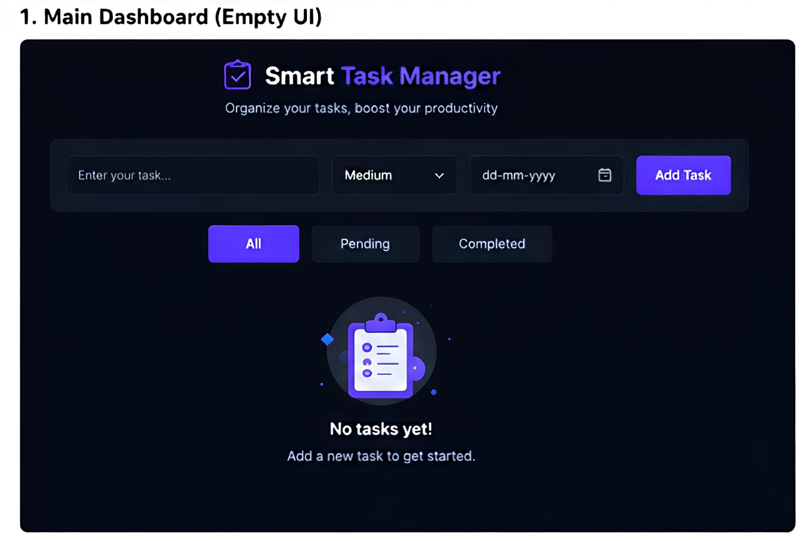
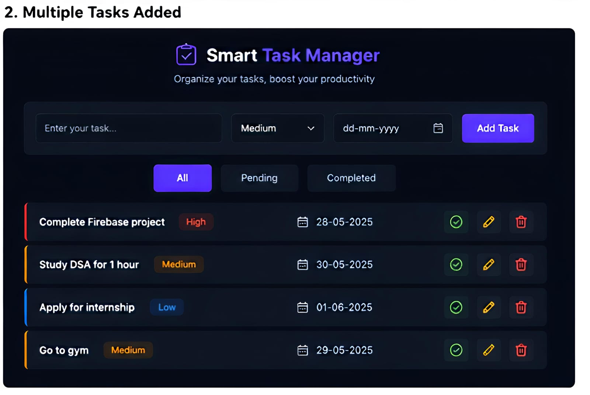
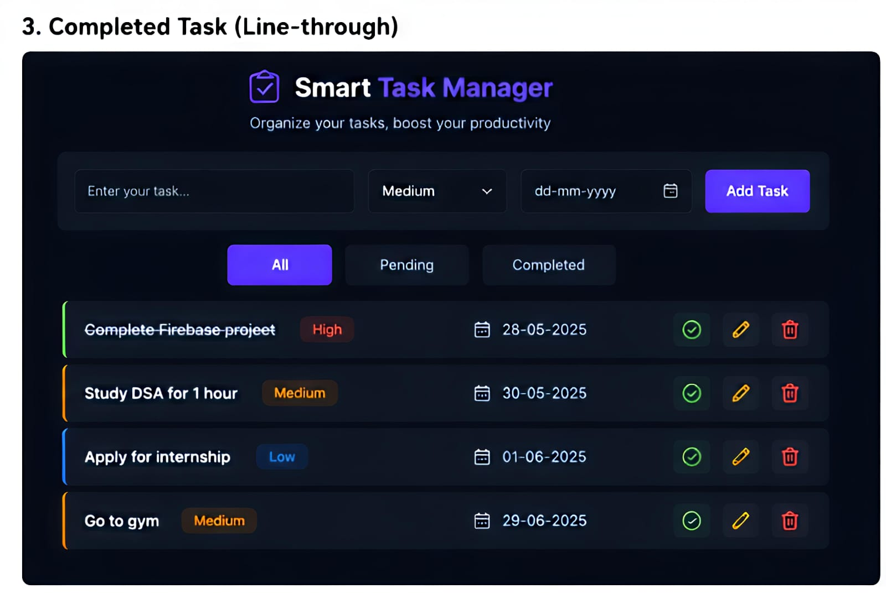
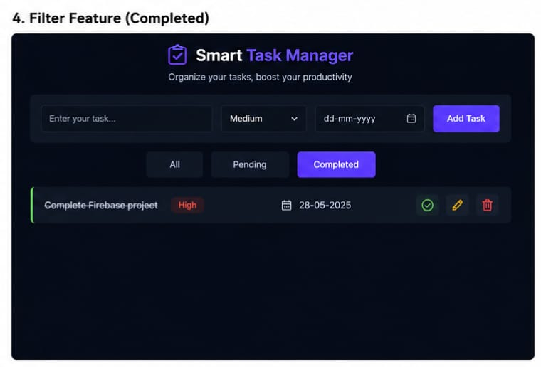

# 🚀 Smart Task Manager

A modern and responsive **Task Management Web Application** built using **HTML, CSS, JavaScript, and Firebase Firestore**.  
This project helps users manage daily tasks efficiently with a clean UI and real-time updates.

---

## ✨ Features

- ➕ Add tasks with **priority levels** (High, Medium, Low)
- 📅 Set **due dates**
- ✅ Mark tasks as **completed**
- 🔍 Filter tasks (All / Pending / Completed)
- 🔄 Real-time updates using Firebase Firestore
- 🎨 Clean and modern dark-themed UI

---

## 📸 Screenshots

### 🖥️ Dashboard

### 📋 Task List

### ✅ Completed Task

### 🔍 Filter Tasks

---

## 🛠 Tech Stack

- HTML  
- CSS  
- JavaScript  
- Firebase Firestore  

---

## ⚙️ Installation & Setup

1. Clone the repository:
   git clone https://github.com/Bumble15/smart-task-manager.git
  
2. Open the project folder:
   cd smart-task-manager
   
3. Run the project:
- Open `index.html` in your browser

---

## 🔮 Future Enhancements

- 🔐 User Authentication (Login/Signup)
- 📊 Dashboard analytics
- 📱 Mobile responsive improvements
- 🔔 Notifications & reminders

---

## 👨‍💻 Author

**Sairaj Bhadale**  
Computer Engineering Student | Web Developer  

---

## ⭐ Show Your Support

If you like this project, please ⭐ the repository!

--- 
